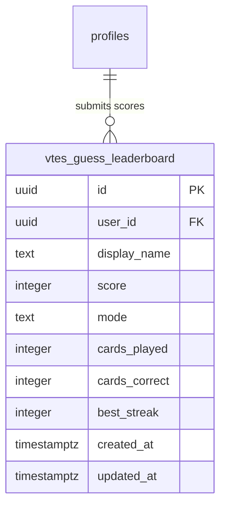
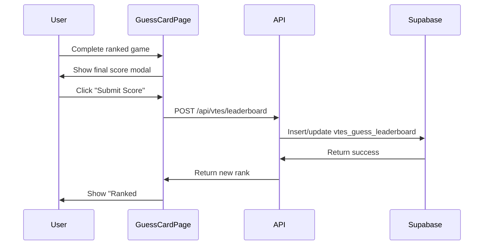

# VTES Guess Card Leaderboard System - Implementation Plan

## Overview

Implement a leaderboard system for the VTES Guess Card game that tracks high scores, streaks, and accuracy for ranked gameplay. The system will allow authenticated users to submit their scores and view global rankings.

## Architecture



## Implementation Steps

### Step 1: Database Migration

**File:** `migrations/18_vtes_guess_leaderboard.sql`

Create the `vtes_guess_leaderboard` table with:
- `id` - UUID primary key
- `user_id` - FK to `profiles.id`
- `display_name` - Snapshot of user's display name at submission time
- `score` - Total score from the game
- `mode` - Game mode ('normal' or 'ranked')
- `cards_played` - Number of cards attempted
- `cards_correct` - Number of correct guesses
- `best_streak` - Best streak achieved in this game
- `created_at` / `updated_at` - Timestamps

RLS policies:
- Everyone can READ (public leaderboard)
- Authenticated users can INSERT their own scores
- Users can UPDATE their own entries (for best score tracking)

### Step 2: API Route

**File:** `src/app/api/vtes/leaderboard/route.ts`

**GET** - Fetch leaderboard entries:
- Query params: `mode` (optional), `limit` (default 100), `offset` (for pagination)
- Returns: Array of leaderboard entries with rank
- No auth required (public data)

**POST** - Submit a score:
- Body: `{ score, mode, cardsPlayed, cardsCorrect, bestStreak }`
- Auth required (via `supabase.auth.getUser()`)
- Validates input
- Upserts entry if new score is better than existing for that user/mode
- Returns: Success status and updated rank

### Step 3: Leaderboard Hook

**File:** `src/hooks/useVtesGuessLeaderboard.ts`

```typescript
export function useVtesGuessLeaderboard(mode?: 'normal' | 'ranked') {
  // State: leaderboard[], loading, error
  // fetchLeaderboard() - fetches top entries
  // submitScore(data) - submits a game score
  // getUserRank(userId, mode) - gets user's current rank
}
```

### Step 4: Leaderboard Component

**File:** `src/components/vtes/GuessLeaderboard.tsx`

**VTES-themed styling matching existing `/vtes/leaderboard/page.tsx`:**
- Uses `Card` component with `variant="glass"`
- Dark slate/red color scheme matching VTES theme
- Table layout with columns:
  - Rank (with crown/medal icons for top 3, `#XX` for others)
  - Player (display name with 2-letter avatar placeholder)
  - Score (primary metric, blood red color)
  - Cards (played / accuracy %)
  - Best Streak (flame icon)

**Features:**
- Tabs for game mode: All / Normal / Ranked
- Time filter: All Time / This Year / This Month
- Highlights user's own entry with `bg-slate-900/30`
- "Your Rank: #XX" indicator for authenticated users
- Empty state with gaming-themed copy

### Step 5: Leaderboard Page

**File:** `src/app/vtes/leaderboard/guess/page.tsx`

**Reuses styling patterns from existing VTES leaderboard:**
- Uses `AppLayout` wrapper
- Header with Trophy icon and VTES-themed title
- Filter controls matching existing leaderboard:
  - Mode selector: All / Normal / Ranked tabs
  - Period filter: All Time / This Year / This Month
- `GuessLeaderboard` component
- "Play Now" button linking to `/vtes/guess-card`

### Step 6: Leaderboard Button in Game Header

**File:** `src/app/vtes/guess-card/page.tsx`

Add a Trophy icon button next to the title that:
- Navigates to `/vtes/leaderboard/guess`
- Shows user's current rank badge if authenticated

### Step 7: Score Submission Modal

**File:** `src/app/vtes/guess-card/page.tsx` (modify ranked completion screen)

In the `showFinalScore` modal (lines 1027-1084):

1. **When ranked game ends:**
   - Check if user is authenticated
   - If authenticated: Show "Submit Score" button + "Skip" button
   - If not authenticated: Show "Sign in to save your score" + "Play Again" + "Normal Mode"

2. **Submission flow:**
   - On submit: Call `submitScore()` from hook
   - On success: Show toast, display new rank, show "View Leaderboard" button
   - On error: Show error toast, allow retry

3. **Modal structure:**
   ```jsx
   {showFinalScore && gameMode === 'ranked' && (
     <Modal>
       <h2>Ranked Complete!</h2>
       <ScoreDisplay score={rankedScore} />
       <StatsRow cards={20} correct={X} streak={Y} />
       
       {user ? (
         <>
           <SubmitScoreButton onSubmit={handleSubmitScore} />
           <SkipButton onClick={handleSkip} />
         </>
       ) : (
         <>
           <SignInPrompt />
           <PlayAgainButton />
           <NormalModeButton />
         </>
       )}
     </Modal>
   )}
   ```

## Technical Details

### Scoring System

The ranked mode uses a point-based system:
- Difficulty 1 (Staple): 2 points
- Difficulty 2 (Common): 5 points
- Difficulty 3 (Uncommon): 10 points
- Difficulty 4 (Rare): 20 points
- 50% penalty if initials hint is used

### Data Flow



### Leaderboard Display

The leaderboard will show:
1. Top 3 with special icons (Crown, Medal)
2. Entries 4+ with rank numbers (`#4`, `#5`, etc.)
3. Highlighted row for current user's entry
4. Avatar placeholder with first 2 letters of name

### VTES Theme Integration

Match existing leaderboard styling:
- Background: `bg-slate-900/50 backdrop-blur-sm`
- Cards: `Card variant="glass"`
- Accents: Gold (`text-yellow-400`) for ranks, Red (`text-red-200`) for score
- Font: Outfit for body, existing VTES display font for headers
- Icons: Trophy (leaderboard), Crown (1st), Medal (2nd/3rd)

## Files to Create/Modify

| File | Action |
|------|--------|
| `migrations/18_vtes_guess_leaderboard.sql` | Create |
| `src/app/api/vtes/leaderboard/route.ts` | Create |
| `src/hooks/useVtesGuessLeaderboard.ts` | Create |
| `src/components/vtes/GuessLeaderboard.tsx` | Create |
| `src/app/vtes/leaderboard/guess/page.tsx` | Create |
| `src/app/vtes/guess-card/page.tsx` | Modify |

## Migration SQL

```sql
CREATE TABLE IF NOT EXISTS public.vtes_guess_leaderboard (
  id UUID PRIMARY KEY DEFAULT uuid_generate_v4(),
  user_id UUID REFERENCES public.profiles(id) ON DELETE CASCADE NOT NULL,
  display_name TEXT NOT NULL,
  score INTEGER NOT NULL,
  mode TEXT NOT NULL CHECK (mode IN ('normal', 'ranked')),
  cards_played INTEGER NOT NULL,
  cards_correct INTEGER NOT NULL,
  best_streak INTEGER NOT NULL,
  created_at TIMESTAMPTZ DEFAULT NOW() NOT NULL,
  updated_at TIMESTAMPTZ DEFAULT NOW() NOT NULL,
  UNIQUE(user_id, mode)
);

ALTER TABLE public.vtes_guess_leaderboard ENABLE ROW LEVEL SECURITY;

CREATE POLICY "Leaderboard is public" ON public.vtes_guess_leaderboard
  FOR SELECT USING (true);

CREATE POLICY "Users can insert own scores" ON public.vtes_guess_leaderboard
  FOR INSERT WITH CHECK (auth.uid() = user_id);

CREATE POLICY "Users can update own scores" ON public.vtes_guess_leaderboard
  FOR UPDATE USING (auth.uid() = user_id);

CREATE INDEX IF NOT EXISTS idx_vtes_guess_leaderboard_mode_score 
  ON public.vtes_guess_leaderboard(mode, score DESC);
```

## Next Steps

1. Review and approve this plan
2. Switch to Code mode to implement
3. Run database migration in Supabase
4. Implement and test
